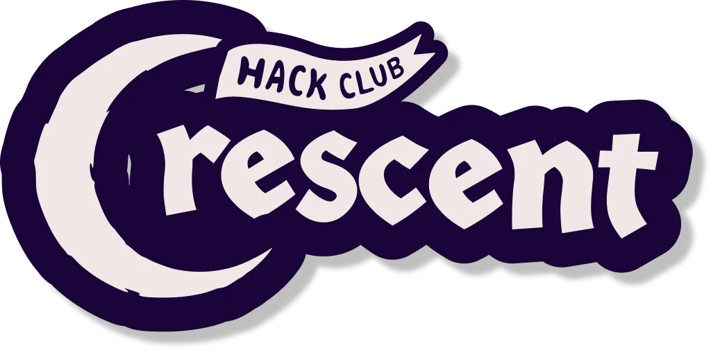
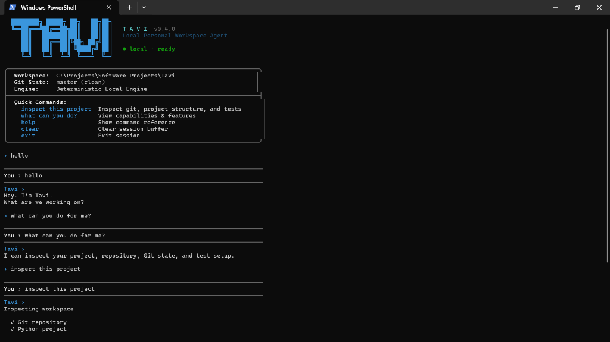
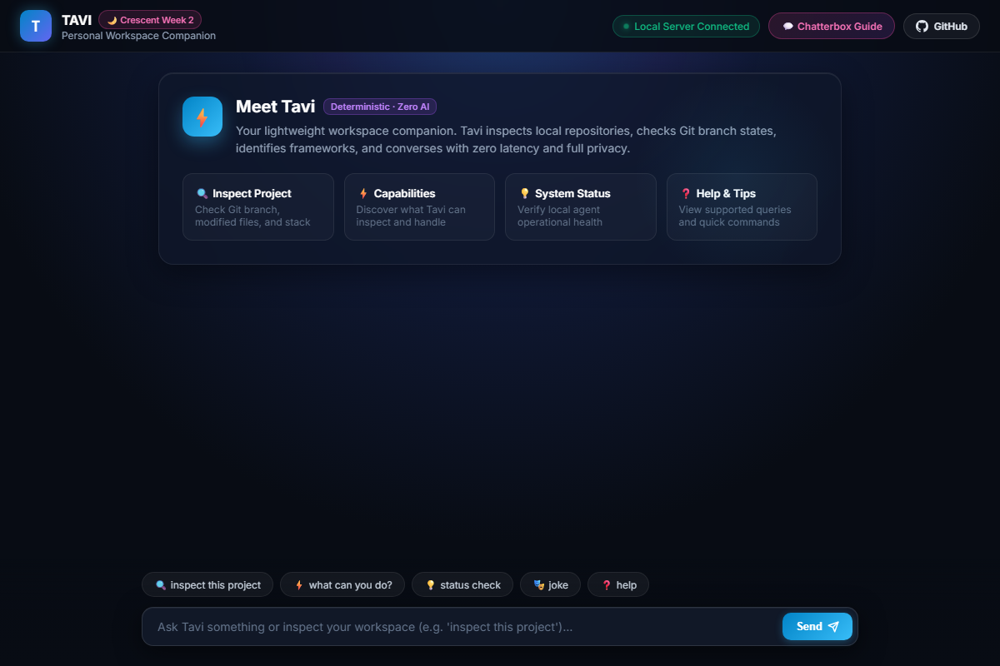

# Tavi — Personal Terminal Workspace Agent & Web Companion

<div align="center">

<a href="https://crescent.hackclub.com/refuge" target="_blank" rel="noopener">
  
</a>

<br/>

<a href="https://hackclub.com" target="_blank" rel="noopener">
  
</a>
&nbsp;&nbsp;&nbsp;&nbsp;&nbsp;&nbsp;&nbsp;&nbsp;
<a href="https://www.python.org" target="_blank" rel="noopener">
  
</a>

<br/><br/>

[](https://www.python.org/)
[](https://docs.python.org/3/library/)
[](https://crescent.hackclub.com/guides/chatterbox)
[](https://crescent.hackclub.com/)
[](https://crescent.hackclub.com/guides/chatterbox)
[](LICENSE)

<br/>

**A lightweight, deterministic personal workspace companion designed to run interactively in your terminal and alongside your browser — built entirely from scratch without AI models, external APIs, or third-party packages.**

<br/>

### 🌟 Quick Launch & Links

<p align="center">
  <a href="https://riteshbonthalakoti.github.io/Tavi/">
    
  </a>
  &nbsp;&nbsp;
  <a href="https://github.com/riteshbonthalakoti/Tavi">
    
  </a>
  &nbsp;&nbsp;
  <a href="https://crescent.hackclub.com/refuge">
    
  </a>
  &nbsp;&nbsp;
  <a href="https://crescent.hackclub.com/guides/chatterbox">
    
  </a>
</p>

</div>

---

## 🌙 Hack Club Crescent & Chatterbox Theme

This project was built by <a href="https://github.com/riteshbonthalakoti"></a> for <a href="https://crescent.hackclub.com/"></a> (<a href="https://crescent.hackclub.com/refuge"></a>), participating in <a href="https://crescent.hackclub.com/guides/chatterbox"></a>.

### The Chatterbox Challenge
> *"Make a believable chatbot without an LLM (like ChatGPT or Claude)! The chatbot has to come from your own code. Rule-based replies, keyword matching, Markov chains... The one thing that doesn't count is an LLM."*

### How Tavi Answers the Challenge
Instead of building a toy therapist or an unpredictable text generator, **Tavi** brings the classical rule-based chatbot philosophy (originating from Joseph Weizenbaum's 1966 **ELIZA**) into a practical developer tool:

1. **Zero External AI / LLMs**: No OpenAI, Anthropic, Gemini, or remote inference APIs.
2. **Zero Weights / Neural Networks**: Operates purely on token normalization, regex pattern matching, and state machine intent routing.
3. **100% Standard Library**: Requires zero pip dependencies (`http.server`, `urllib`, `subprocess`, `re`, `pathlib`).
4. **Authentic Utility**: Beyond small talk, Tavi performs deterministic, read-only system introspection on your local repositories.

---

## 🎯 Primary Use Cases

1. **Air-Gapped & Offline Developer Companion**: When writing code on flights, trains, or secure offline workstations without internet access, Tavi runs with zero latency and zero connection requirements.
2. **Zero-Telemetry Security**: Proprietary codebases and sensitive repositories are never uploaded to third-party AI cloud providers. All operations are strictly local and read-only.
3. **Instant Workspace Health Check**: Quickly check repository status, working branch, unstaged modifications, stack types, and test frameworks in a single command directly from the terminal or browser.
4. **Ultra-Low Resource Footprint**: Eliminates memory-heavy background AI daemons; uses less than 15 MB of RAM and executes in under 2 milliseconds.

---

## 📸 Visual Showcase

### 1. Interactive Terminal Agent CLI
The terminal interface launches with an ASCII card, showing live workspace context, Git branch status, and interactive prompt:



### 2. Dedicated Web Companion Application
Unlike a basic terminal mimic, the web companion is a modern, responsive web application interface featuring interactive quick cards, live backend connection badges, structured dashboard inspection cards, and standalone client-side fallback:



---

## ⚡ Quick Start

### Prerequisites
- <a href="https://www.python.org/downloads/"></a> (Standard library only; no virtual environment or `pip install` needed).
- <a href="https://git-scm.com/"></a> (For repository inspection features).

### Running the Terminal Agent
```bash
git clone https://github.com/riteshbonthalakoti/Tavi.git
cd Tavi
python tavi.py
```

### Running the Local Web Server
```bash
python web.py
```
Open <a href="http://localhost:8000"></a> in any web browser.

Or use the hosted version on GitHub Pages: <a href="https://riteshbonthalakoti.github.io/Tavi/"></a>.

---

## 💬 Sample Conversations & Transcripts

As recommended by the Chatterbox specification, here are real transcripts showing Tavi on its best behavior and when dealing with unknown queries:

### Transcript 1: On Its Best Behavior (Workspace Inspection & Status)
```text
› hello tavi
Tavi ›
Hey. I'm Tavi.
What are we working on?

› what can you do?
Tavi ›
I can inspect your project, repository, Git state, and test setup.

› inspect this project
Tavi ›
Inspecting workspace

  ✓ Git repository
  ✓ Python project
  ✓ pytest detected

  PROJECT
  Python · pytest · master · clean
```

### Transcript 2: Graceful Confusion & Deflection (Handling Unsupported Queries)
```text
› can you order a pizza for me?
Tavi ›
I can help with project work right now.
Try asking me to inspect your project.

› tell me a joke
Tavi ›
I can't do that one yet.
I'm currently focused on project work.

› what is the meaning of life?
Tavi ›
I can help with project work right now.
Try asking me to inspect your project.
```

---

## 🛠️ Rebuilding Tavi From Scratch

Anyone can reproduce and rebuild Tavi in ~30 minutes following this architectural blueprint:

```text
Tavi/
├── assets/
│   ├── crescent-logo.webp # Scraped official Hack Club Crescent moon banner
│   ├── hackclub-flag.svg  # Official Hack Club Orpheus flag vector
│   ├── hackclub-icon.svg  # Rounded Hack Club brand icon
│   └── python-logo.svg    # Python official vector logo
├── tavi.py                # 1. Intent engine, workspace inspection, and terminal CLI
├── web.py                 # 2. Native HTTP server & REST endpoint
├── index.html             # 3. Modern web companion UI with standalone client fallback
├── screenshot-cli.png     # Terminal screenshot
├── screenshot-web.png     # Modern web companion screenshot
├── screenshot.png         # Project card thumbnail
├── LICENSE                # MIT License
└── README.md              # Project documentation
```

### Step 1: Build the Intent Classifier (`tavi.py`)
Strip all punctuation and collapse whitespace so queries like `"Hello, Tavi!"` or `"HELLO   TAVI"` normalize to `"hello tavi"`:

```python
import re

def normalize(text: str) -> str:
    cleaned = re.sub(r"[^\w\s]", " ", text.lower())
    return " ".join(cleaned.split())

def classify(text: str) -> str:
    norm = normalize(text)
    if not norm:
        return "empty"
    if re.search(r"^(hi|hello|hey|good morning)(\s+tavi)?$", norm):
        return "greeting"
    if re.search(r"^(how are you|hows it going|you okay)(\s+tavi)?$", norm):
        return "status"
    if re.search(r"^(what can you do|capabilities|features)(\s+tavi)?$", norm):
        return "capabilities"
    if re.search(r"^(inspect|check|analyze)\s+(this|my)?\s*(project|repo|repository)$", norm):
        return "inspect_project"
    if norm in ("exit", "quit", "q"):
        return "exit"
    return "unknown"
```

### Step 2: Build the Deterministic Workspace Inspector (`tavi.py`)
Inspect the current workspace directory using `subprocess` and `pathlib.Path`:

```python
import subprocess
from pathlib import Path

def inspect_project(workspace_dir: str = ".") -> str:
    root = Path(workspace_dir).resolve()
    facts = []

    # Check Git repository & branch
    git_check = subprocess.run(["git", "rev-parse", "--is-inside-work-tree"], cwd=root, capture_output=True, text=True)
    if git_check.returncode == 0 and git_check.stdout.strip() == "true":
        branch = subprocess.run(["git", "branch", "--show-current"], cwd=root, capture_output=True, text=True).stdout.strip()
        status = subprocess.run(["git", "status", "--porcelain"], cwd=root, capture_output=True, text=True).stdout.strip()
        facts.append(f"✓ Git repository ({branch}, {'clean' if not status else 'dirty'})")

    # Detect Project Types via Marker Files
    markers = {
        "Python": ["pyproject.toml", "requirements.txt", "setup.py"],
        "Node": ["package.json"],
        "Rust": ["Cargo.toml"],
        "Go": ["go.mod"]
    }
    for tech, files in markers.items():
        if any((root / f).exists() for f in files):
            facts.append(f"✓ {tech} project")

    return "\n".join(["Inspecting workspace:"] + [f"  {f}" for f in facts])
```

### Step 3: Implement the Native HTTP Server (`web.py`)
Implement `http.server.BaseHTTPRequestHandler` to serve the static frontend and answer `POST /chat` with CORS enabled:

```python
from http.server import HTTPServer, BaseHTTPRequestHandler
import json
from tavi import respond

class TaviHandler(BaseHTTPRequestHandler):
    def do_GET(self):
        if self.path in ("/", "/index.html"):
            content = open("index.html", "rb").read()
            self.send_response(200)
            self.send_header("Content-Type", "text/html; charset=utf-8")
            self.end_headers()
            self.wfile.write(content)

    def do_POST(self):
        if self.path in ("/chat", "/api/chat"):
            length = int(self.headers.get("Content-Length", 0))
            payload = json.loads(self.rfile.read(length).decode("utf-8"))
            reply = respond(payload.get("message", ""))
            response_data = json.dumps({"response": reply}).encode("utf-8")
            self.send_response(200)
            self.send_header("Access-Control-Allow-Origin", "*")
            self.send_header("Content-Type", "application/json")
            self.end_headers()
            self.wfile.write(response_data)

if __name__ == "__main__":
    HTTPServer(("127.0.0.1", 8000), TaviHandler).serve_forever()
```

### Step 4: Web Companion with Dual-Engine Fallback (`index.html`)
Build a modern, responsive web application interface using vanilla HTML/CSS. If the local backend server is offline or the user visits via static GitHub Pages, activate an embedded JavaScript deterministic intent engine fallback so the companion is always functional:

```javascript
async function sendQuery(userText) {
  try {
    const res = await fetch("http://127.0.0.1:8000/chat", {
      method: "POST",
      headers: { "Content-Type": "application/json" },
      body: JSON.stringify({ message: userText })
    });
    if (res.ok) {
      const data = await res.json();
      return data.response;
    }
  } catch (err) {
    // Client-side deterministic fallback engine
    return getLocalFallbackResponse(userText);
  }
}
```

---

## 📋 Full Command & Intent Reference

| Intent | Pattern Examples | Output Description |
| :--- | :--- | :--- |
| **Greeting** | `hi`, `hello`, `hey tavi` | Welcoming response ready for work |
| **Status** | `how are you?`, `status`, `you okay` | Operational health and state check |
| **Activity** | `what are you doing?`, `what's up` | Current capability status |
| **Capabilities** | `what can you do?`, `features` | Detailed list of supported operations |
| **Workspace Inspection** | `inspect this project`, `check repo` | Analyzes Git repo, branch, status, project stack, and tests |
| **Help** | `help`, `commands`, `how do i use this` | Interactive command guide and suggestions |
| **Clear** | `clear`, `cls` | Clears terminal screen and re-renders banner card |
| **Exit** | `exit`, `quit`, `q`, `bye` | Closes the interactive terminal session |
| **Fallback** | *Any unhandled input* | Graceful deflection steering back to project tools |

---

## 📄 License

This project is licensed under the <a href="LICENSE"></a> — free for anyone in the world to study, rebuild, fork, and adapt.
